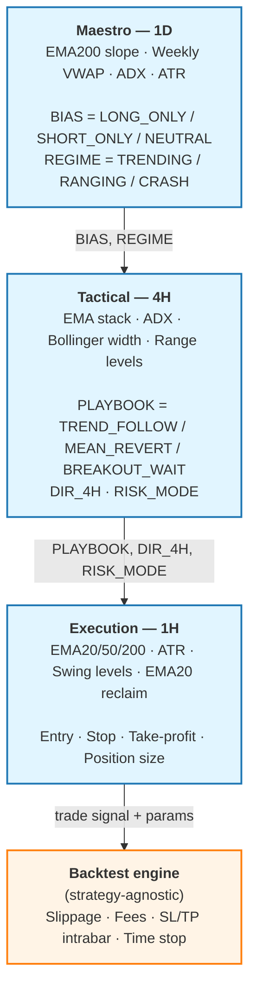
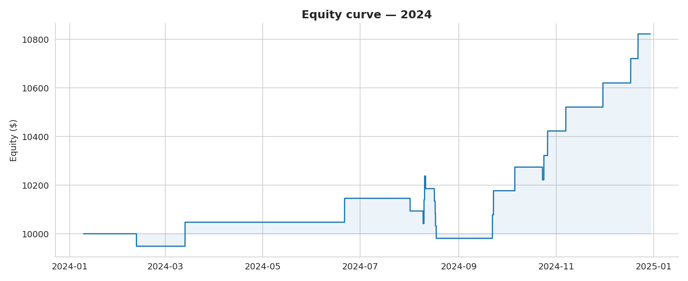
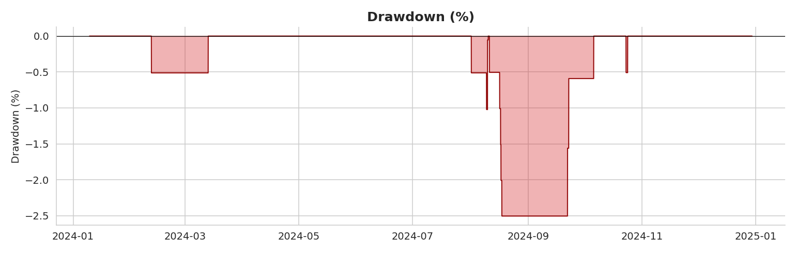
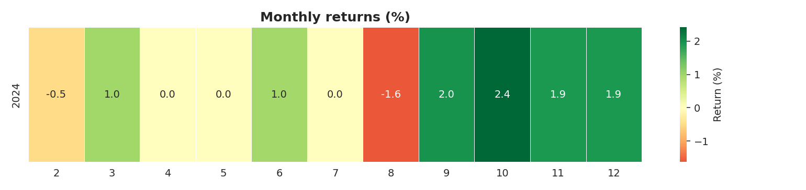

# Triarchy

[](https://github.com/damienLeveque/triarchy/actions/workflows/ci.yml)
[](https://www.python.org/downloads/)
[](https://opensource.org/licenses/MIT)
[](#testing)
[](https://github.com/astral-sh/ruff)

> **A three-layer hierarchical systematic trading system.** Strategic bias, tactical playbooks, execution discipline.

Triarchy is a crypto trading research framework built on a strict hierarchical decision architecture. Each layer operates at a different timeframe and answers a different question. The lower layer **cannot override** the upper. A 1H long signal is ignored if the 1D Maestro is `SHORT_ONLY`. This is the discipline of the system.

## Project background

I have followed the crypto market since 2015 and have invested personally over the years. Triarchy grew out of that long-term interest, but the project is not a “profit bot” claim. It is a human research project first: many hours of testing, failed assumptions, messy experiments, and gradual engineering cleanup.

I started the first version in December 2025 as an exploratory trading bot, then revisited it in February 2026 with a much stronger engineering and research direction. The early version was intentionally rough: I tested many strategies, rewrote large parts of the system, and spent roughly 300–400 hours experimenting with different market regimes, moving-average parameters, 1D/4H/1H timeframe combinations, indicators, filters, risk rules, and backtesting assumptions.

The current strategy is not presented as the optimal way to generate profit. Instead, Triarchy is a structured foundation for systematic research: a clean architecture where strategies can be tested, rejected, improved, and compared without rewriting the whole system. The value of the project is the decision framework, the risk-gated architecture, the reproducible pipeline, and the ability to reason intelligently about what could become profitable under better validation.

---

## Architecture



**Risk gating cascades down:** if Maestro detects a `CRASH` regime → Tactical sets `RISK_MODE=OFF` → Execution refuses all entries.

---

## Why this design

Most retail trading bots fail because they conflate timeframes. They spot a 1H bullish setup during a multi-day downtrend and take the trade anyway. Triarchy enforces **structural alignment**: every entry must agree with all three layers simultaneously.

This mirrors a common pattern in systematic research: separating regime detection, signal generation, and execution logic into independently testable layers.

It's also the natural foundation for an **agentic overlay** (see roadmap): an LLM-driven Macro Agent can supplement rule-based regime detection with unstructured context (news, macro events) without touching the deterministic execution path.

---

## Results — multi-year walk-forward

The same configuration is used for every year. **No parameters are tuned per year.** See [`docs/walk_forward.md`](docs/walk_forward.md) for the full methodology.

> These are historical backtest results for engineering and research purposes only. They do not imply live profitability and are not financial advice.

| Year | Trades | Win rate | Avg R | Total return | Sharpe | Sortino | Max DD | Calmar |
|------|-------:|---------:|------:|-------------:|-------:|--------:|-------:|-------:|
| 2022 |      9 |    55.6% |  0.64 |       +2.9%  |  1.20  |   8.22  |  -1.0% |  2.91  |
| 2023 |     21 |    47.6% |  0.39 |       +4.1%  |  1.19  |   5.94  |  -1.6% |  2.70  |
| 2024 |     22 |    59.1% |  0.74 |       +8.2%  |  2.13  |  25.70  |  -2.5% |  3.38  |
| 2025 |     12 |    25.0% | -0.29 |       -1.7%  | -0.75  |  -2.95  |  -3.6% | -0.50  |

> Numbers above come from a representative pipeline run. Full breakdown in [`notebooks/01_portfolio_analysis.ipynb`](notebooks/01_portfolio_analysis.ipynb).

### Equity curve (2024)



### Drawdown profile (2024)



### Monthly returns



---

## Quick start

```bash
git clone https://github.com/damienLeveque/triarchy.git
cd triarchy
python -m venv .venv && source .venv/bin/activate
pip install -e ".[dev]"
```

```bash
# 1. Fetch OHLCV data (1D + 4H + 1H) for one year
triarchy fetch --year 2024 --timeframes 1d --timeframes 4h --timeframes 1h

# 2. Run the end-to-end pipeline (Maestro → Tactical → Execution → Backtest)
triarchy run --year 2024

# 3. Run multi-year walk-forward analysis
triarchy run --years 2022 --years 2023 --years 2024 --years 2025

# 4. Inspect results
triarchy show-results --year 2024
ls BACKTEST_RESULTS/2024/
# trades.csv  summary.csv  equity_curve.csv
# equity_curve.png  drawdown.png  monthly_returns.png  r_distribution.png  by_regime.png
```

Each layer can also be run independently for debugging:

```bash
triarchy maestro   --year 2024              # 1D BIAS + REGIME
triarchy tactical  --year 2024              # 4H PLAYBOOK + DIR + RISK_MODE
triarchy execution --year 2024              # 1H feature set + cascaded context
```

Every intermediate is **persisted as CSV** so you can inspect what each layer produced at any point:

```
DATA_CACHE/2024/1h/BTCUSDT_1h_2024.csv          # raw OHLCV
STRATEGY_DATA/2024/BTCUSDT_BIAS.csv             # Maestro output
STRATEGY_DATA/2024/BTCUSDT_TACTICAL_4H.csv      # Tactical output
STRATEGY_DATA/2024/BTCUSDT_EXECUTION_1H.csv     # Execution features + context
BACKTEST_RESULTS/2024/                          # backtest outputs (CSV + PNG)
```

---

## Project structure

```
triarchy/
├── src/triarchy/
│   ├── config.py              # Typed JSON config loaders (dataclasses)
│   ├── pipeline.py            # End-to-end orchestrator with CSV caching
│   ├── cli.py                 # `triarchy` command-line interface
│   ├── data/
│   │   └── fetcher.py         # ccxt OHLCV fetcher with disk cache
│   ├── indicators/
│   │   ├── trend.py           # EMA, slope
│   │   ├── volatility.py      # ATR, Bollinger
│   │   └── momentum.py        # ADX
│   ├── strategy/
│   │   ├── maestro.py         # 1D: BIAS + REGIME (pure logic)
│   │   ├── tactical.py        # 4H: PLAYBOOK + DIR + RISK_MODE (pure logic)
│   │   └── execution.py       # 1H: signals + trade params (pure logic)
│   └── backtest/
│       ├── engine.py          # Strategy-agnostic bar-by-bar simulator
│       ├── metrics.py         # Sharpe / Sortino / Calmar / MDD / expectancy
│       └── plots.py           # Equity, drawdown, heatmap, R distribution
├── configs/                   # JSON configs for each layer
├── tests/                     # 61 pytest tests across all modules
├── notebooks/                 # Portfolio analysis & visualizations
└── docs/                      # Architecture, walk-forward methodology
```

---

## Design choices worth noting

**Pure-function strategy modules.** Every strategy layer (`maestro.py`, `tactical.py`, `execution.py`) contains *only* indicator math and classification logic — no I/O, no exchange calls, no file paths. This means each layer is unit-testable in isolation and the engine is reusable for the future agentic overlay.

**Strategy-agnostic backtest engine.** The engine consumes a `signal_at(row, cfg) → Signal | None` function and a `compute_trade_params(...)` function. It knows nothing about EMAs, ADX, or the cascade. Plug in a different signal generator (or eventually an LLM agent) and the engine doesn't care.

**Cascaded risk gating.** A `REGIME=CRASH` signal at the 1D layer cascades to `RISK_MODE=OFF` at the 4H layer, which causes the 1H execution layer to refuse all entries. This is a hard kill-switch that doesn't depend on the lower layers correctly recognizing the crash.

**Typed configs from JSON.** Every parameter lives in `configs/*.json` and is loaded into typed `@dataclass(frozen=True)` containers via `triarchy.config`. No magic numbers in code, no dict-of-dicts in hot paths, autocomplete works in any IDE.

**CSV-cached intermediates.** Each layer's output is persisted as CSV. This makes debugging trivial (`open BTCUSDT_TACTICAL_4H.csv` and read the columns) and makes re-runs cheap — the pipeline only recomputes what's missing or what you `--force`.

---

## Testing

```bash
pytest                          # run all 61 tests
pytest --cov=triarchy            # with coverage
pytest tests/test_engine.py -v   # one module
```

Tests cover indicators, metrics, strategy classification, exit resolution, position sizing, slippage modeling, gating logic, config loading, and end-to-end engine behavior.

---

## Roadmap

- [x] Three-layer hierarchical strategy with cascaded risk gating
- [x] Backtest engine with realistic execution costs (slippage, fees, time stops)
- [x] Multi-year walk-forward analysis (2022–2025)
- [x] Performance attribution by regime / playbook / symbol
- [ ] **Agentic overlay** *(planned)* — LangGraph orchestrator with:
  - Macro Agent: LLM-driven news + macro context → modulates BIAS / RISK_MODE
  - Risk Orchestrator: validates trades against deterministic rules before execution
  - Eval framework: rules-only vs rules+agentic A/B comparison
- [ ] Live paper trading via Binance testnet
- [ ] Anchored walk-forward optimization for the agentic-tuned parameters

---

## Tech stack

- **Python 3.11+**, pandas, numpy
- **ccxt** for exchange data (Binance Futures)
- **pytest** + ruff for testing and linting
- **matplotlib** for visualizations
- **click** for the CLI
- *(planned)* **LangGraph + Pydantic AI + Anthropic** for the agentic overlay

---

## License

MIT
